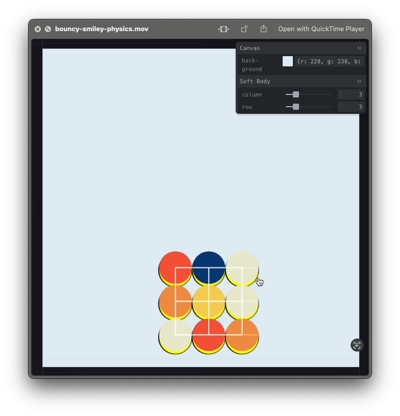
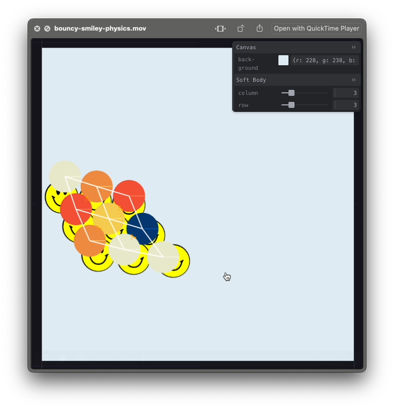
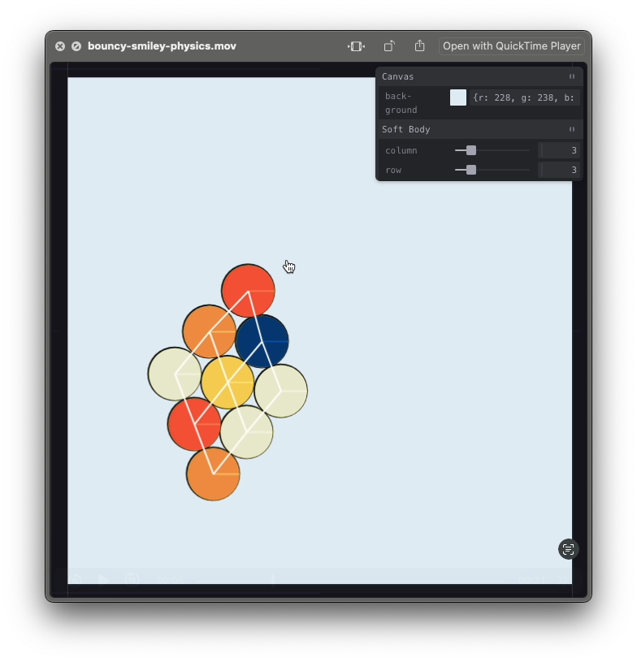
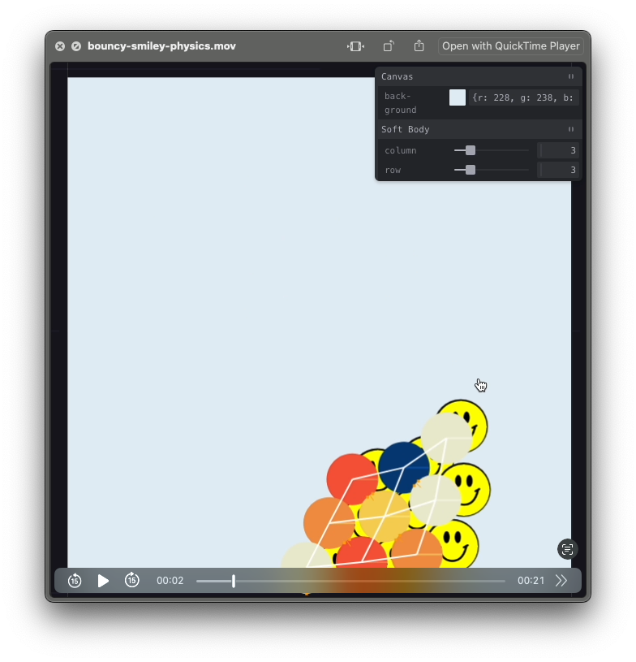

# Soft Body Smiley

An experiment with Matter.js soft body physics.

### Smileys Drawn in p5.js

### Smileys Drawn in Matter.js

## P5.js vs Matter.js

-   There seems to be a subtle shift as the bodies in Matter goes down. Not observed in P5.
-   📝 Perhaps simply copying the Matter bodies' position & rotation to p5 shapes is not enough.

