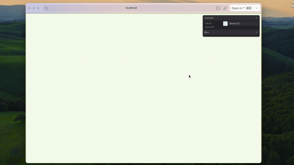

# Cursor Following Arrows

Let the arrows in circle follow your cursor! Customise the symbol, size, colors and more 👾🌈

### Notes

-   atan2 formula: calculate the angle between 2 points
-   lerp formula: smooth transition from one value to another
-

### Process

1. How it started
   

2. Adding cursor following effect
   

3. Add rotation lerp for smoother animation ✨
   

4. More customisation, using [tweakpane](https://github.com/cocopon/tweakpane) is quite cool!
   
